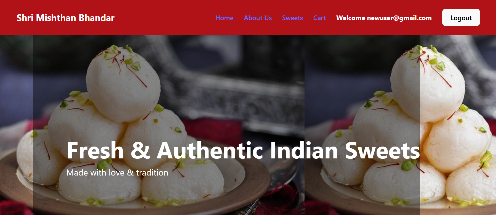
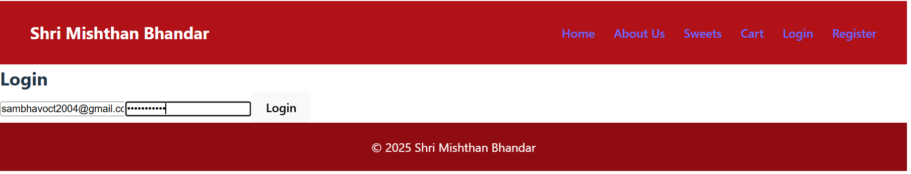
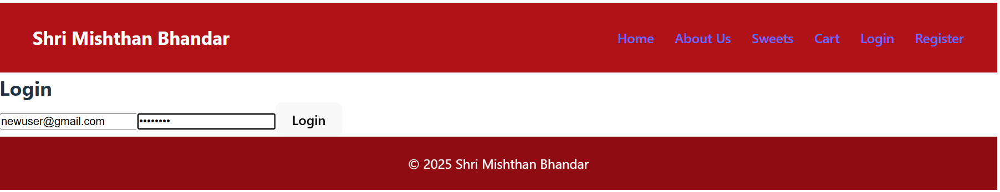
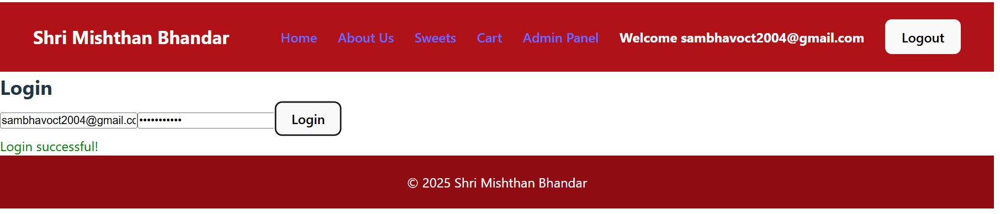
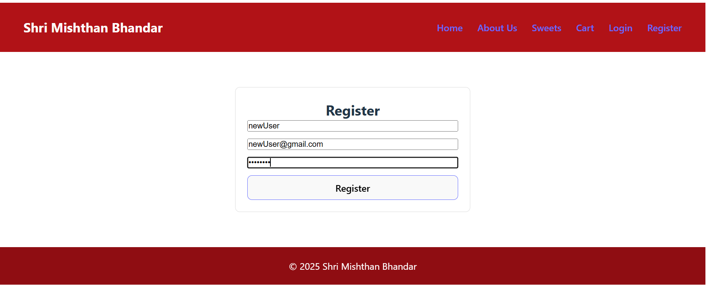
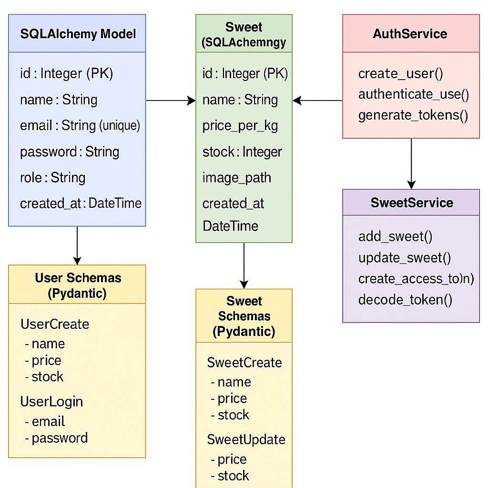

# 🍬 Shri Mishthan Bhandar – Sweet Shop Management System

**“Serving the sweetness of tradition with purity and trust”**

Shri Mishthan Bhandar is a **full-stack Sweet Shop Management System** built using a
**RESTful API architecture**.  
The backend is **fully implemented and tested**, while the frontend is being
developed using **React + Vite**.

This system is designed to model a **real-world Indian sweet shop workflow**
with secure authentication, role-based access, and scalable architecture.

---

## 🌟 Project Overview

This application allows:
- Customers to create an account and log in securely
- Users to browse traditional Indian sweets
- Orders to be placed only when stock is available
- Multiple items to be added to the cart and purchased
- Secure handling of authentication and authorization

The backend follows clean architecture principles and industry best practices.

---

## 🎯 Core Features

### 👤 User Features
- User registration and login (JWT-based)
- Browse sweets with stock availability
- Search and filter sweets as per requirements
- Add items to cart and checkout
- Forgot password and reset password functionality
- Order placement restricted to available stock

---

### 🛠️ Admin Features
- Separate admin authentication
- Create new sweets
- Update sweet details (price, image, description)
- Increase or decrease stock
- Delete sweets
- Role-based access control at the backend level

---

## 🔐 Backend Features

- JWT-based authentication
- Role-based authorization (Admin / User)
- RESTful CRUD APIs
- Stock management system
- Cart and order checkout logic
- Password recovery workflows
- Fully tested API endpoints
- Clean and scalable backend architecture

---

## 🎨 Frontend Features (In Progress 🚧)

- React + Vite based UI
- Traditional Indian sweets themed design
- Navbar with routing
- Home hero section
- Sweets listing page
- Cart page
- Login and registration pages

---

## 🧪 Testing

- Automated backend testing using **pytest**
- Edge cases covered
- API reliability and correctness ensured

---

## 🧰 Tech Stack

### Backend
- FastAPI
- SQLAlchemy
- JWT Authentication

### Frontend
- React
- Vite

### Database
- SQLite

### Testing
- pytest

---

## 📂 Project Structure

sweet-shop-management/
│── backend/
│ ├── app/
│ ├── tests/
│ └── requirements.txt
│
│── frontend/
│ ├── src/
│ └── package.json
│
│── docs/
│ ├── screenshots/
│ ├── diagrams/
│ └── test-report.md
│
│── README.md

yaml
Copy code

---

## ⚙️ How to Run the Project

### 🔧 Backend Setup

```bash
cd backend
pip install -r requirements.txt
uvicorn app.main:app --reload
```
API will run at: http://127.0.0.1:8000

Swagger documentation: http://127.0.0.1:8000/docs

## 🎨 Frontend Setup
```bash
Copy code
cd frontend
npm install
npm run dev
Frontend runs at: http://localhost:5173
```
## 📘 API Documentation
The backend follows RESTful API design principles with proper HTTP methods,
status codes, and secure authentication.

## 🔑 Authentication Flow
User or Admin logs in or registers

Backend issues a JWT access token

Token is sent with each protected request using:

makefile
Copy code
Authorization: Bearer <access_token>
Role-based middleware validates permissions

📌 Admin & User API Endpoints
👤 Authentication Endpoints
Method	Endpoint	Description	Access
POST	/auth/register	Register a new user	Public
POST	/auth/login	User/Admin login	Public
POST	/auth/forgot-password	Send password reset link	Public
POST	/auth/reset-password	Reset user password	Public

🍬 Sweet (Product) Endpoints
Method	Endpoint	Description	Access
GET	/sweets/	Retrieve all sweets	User
GET	/sweets/{id}	Retrieve sweet by ID	User
POST	/sweets/	Create a new sweet	Admin
PUT	/sweets/{id}	Update sweet details	Admin
DELETE	/sweets/{id}	Delete a sweet	Admin

📦 Stock Management Endpoints
Method	Endpoint	Description	Access
PATCH	/sweets/{id}/increase-stock	Increase sweet stock	Admin
PATCH	/sweets/{id}/decrease-stock	Decrease sweet stock	Admin

🛒 Cart & Order Endpoints
Method	Endpoint	Description	Access
POST	/cart/add	Add item to cart	User
DELETE	/cart/remove	Remove item from cart	User
GET	/cart/	View cart	User
POST	/order/checkout	Place an order	User


---

### 🏠 Home Page




---

### 🔐 Login Page







---

### 📝 Registration Page





---

### 🍬 Sweets Ordering Section


## 📊 Diagrams

### Backend Architecture Diagram




## 🚀 Future Enhancements
* Online payment gateway integration

* Live order tracking

* Admin order management dashboard

* Customer management system

* Marketing campaign management

* AI-based sweet recommendation system:

* Diabetic suitability scoring

* Ingredient-based health analysis

* Personalized sweet recommendations

## 🤖 AI Usage Declaration
### Backend
Backend architecture and database schema were fully designed by me

Core API logic and system design were implemented manually

AI tools were used for:

Concept clarification

Debugging assistance

Validation of best practices

AI usage details are documented in individual commits

### Frontend
UI structure and business logic were planned manually

AI tools assisted in code generation

All generated code was reviewed, understood, and integrated manually

AI was used as a learning and assistance tool, not as a replacement for development.


👨‍💻 Author
Sambhav
Computer Science Engineering Student
Chandigarh University

👨‍💻 Co-authored-by: ChatGPT <AI@users.noreply.github.com>

📜 License
This project is licensed under the MIT License.
